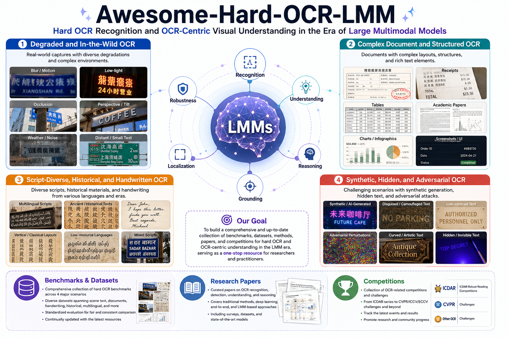

# Awesome-Hard-OCR-LMM

  <strong>English</strong> | <a href="./README_CN.md">简体中文</a>

  
  
  
  

  

This repository curates recent research on **hard OCR recognition** and **OCR-centric visual understanding** in the era of **large multimodal models (LMMs)** and **vision-language models (VLMs)**.

Unlike general OCR, document AI, or broad MLLM benchmark lists, this collection focuses on cases where reading text is genuinely difficult: degraded and in-the-wild images, dense or small text, complex document structure, multilingual and historical scripts, handwriting, hidden text, and synthetic/adversarial visual text. The main coverage starts from **2023**, when LMM/VLM-based OCR and text-rich visual understanding began to emerge as a distinct research direction.

🚀🚀🚀 Contributions are welcome. If you find a missing paper, benchmark, or challenge, please open an issue with the title, link, venue/year, and a short note explaining why it fits hard OCR.

---

## Contents

- [Introduction](#introduction)
- [Benchmarks & Datasets](#benchmarks-datasets)
- [Research Papers](#research-papers)
  - [Degraded and In-the-Wild OCR](#degraded-and-in-the-wild-ocr)
  - [Complex Document and Structured OCR](#complex-document-and-structured-ocr)
- [Script-Diverse, Historical, and Handwritten OCR](#script-diverse-historical-and-handwritten-ocr)
  - [Synthetic, Hidden, and Adversarial OCR](#synthetic-hidden-and-adversarial-hard-ocr)
- [Competitions](#competitions)
- [Contact Us](#contact-us)

---

## ✨ Introduction

**Hard OCR** refers to OCR recognition or OCR-centric understanding under challenging visual, linguistic, structural, or synthetic conditions. The goal of this repository is to track work where OCR is not merely a preprocessing step, but a core bottleneck for multimodal perception and reasoning.

### 🧭 Taxonomy

All **benchmarks and datasets** are grouped in **Benchmarks & Datasets**. The four subsections under **Research Papers** contain only models, methods, or systems, not standalone benchmark entries. 

| Category | Includes | Excludes |
|---|---|---|
| Benchmarks & Datasets | OCR-Centric Hard Benchmarks | General MLLM benchmarks |
| Degraded and In-the-Wild OCR | Real-world visual difficulty: blur, low resolution, noise, compression, poor lighting, screen photos, scan artifacts, skew, occlusion, missing text, small or dense text, and complex scene context | Ordinary scene text recognition on clean, clear, and easy images |
| Complex Document and Structured OCR | Structural document difficulty: layout and reading order, tables, formulas, charts, multi-page context, KIE, grounding or relation extraction, and faithful Markdown/HTML/LaTeX/JSON-style output | Ordinary clean PDF-to-text OCR without explicit structural challenges |
| Script-Diverse, Historical, and Handwritten OCR | Script, writing-style, or historical-domain shift: low-resource or non-Latin scripts, script-specific orthographic complexity, historical or ancient documents, calligraphy, handwriting, handwritten formulas, and rare-script decipherment | Ordinary modern printed OCR in high-resource scripts |
| Synthetic, Hidden, and Adversarial Hard OCR | Synthetic, hidden, illusion-based, adversarial, or manipulated visual text where recognizing, localizing, or robustly interpreting text is central | General VLM attacks, jailbreaks, broad AIGC-risk detection, or synthetic image generation without explicit OCR/text-reading evaluation |

---

### 🏷️ Cross-Cutting Tags

Papers may have multiple tags because hard OCR factors often overlap. Tags are grouped by the role they play in describing a paper.

| Group | Tags | Meaning |
|---|---|---|
| Core task | `recognition`, `localization` | Direct text transcription, character/word recognition, text detection, grounding, or region-level OCR. |
| OCR-centric understanding | `reasoning`, `text-rich-vqa`, `document-qa`, `translation`, `KIE` | Downstream understanding where visual text is essential, including reasoning from OCR cues, VQA over text-rich images or documents, cross-lingual OCR/translation, and key information extraction. |
| Visual difficulty | `degraded`, `occlusion`, `dense-text`, `high-resolution`, `scene-text`, `in-the-wild` | Hard visual conditions such as blur, noise, low resolution, compression, scan artifacts, occluded or incomplete text, tiny/dense text, high-resolution inputs, and real-world scene text. |
| Document structure | `layout`, `structured-output`, `table/chart`, `table`, `formula`, `multi-page`, `long-context` | Page structure and structured conversion, including reading order, multi-column layout, Markdown/HTML/LaTeX/JSON-style output, tables, charts, formulas, multi-page documents, and long textual contexts. |
| Language and script | `multilingual`, `low-resource`, `script-diverse`, `historical`, `handwriting` | Language, script, and writing-style shift, including multilingual OCR, low-resource scripts, rare scripts, historical documents, old fonts, calligraphy, and handwriting. |
| Synthetic or adversarial text | `synthetic-hard`, `hidden/adversarial` | Synthetic or AIGC-created hard OCR samples, hidden or illusion text, adversarial visual text, and manipulated visual text artifacts. |

[[⬆️ Back to Top](#contents)]

---

## 📊 Benchmarks & Datasets

| Benchmark | Paper | Venue & Year | Highlights | Tags | Download |
|---|---|---|---|---|---|
| OCRBench | [OCRBench: On the Hidden Mystery of OCR in Large Multimodal Models](https://arxiv.org/abs/2305.07895) | arXiv 2023 | OCR-focused LMM evaluation across scene text, document VQA, KIE, and handwritten math. | `recognition`, `document-qa`, `KIE`, `formula`, `handwriting` | [GitHub](https://github.com/Yuliang-Liu/MultimodalOCR/blob/main/OCRBench/README.md) |
| OCRBench v2 | [OCRBench v2: An Improved Benchmark for Evaluating Large Multimodal Models on Visual Text Localization and Reasoning](https://arxiv.org/abs/2501.00321) | NeurIPS D&B 2025 | Bilingual benchmark with 31 scenarios for recognition, localization, layout perception, and OCR reasoning. | `recognition`, `localization`, `layout`, `reasoning` | [GitHub](https://github.com/Yuliang-Liu/MultimodalOCR/blob/main/OCRBench_v2/README.md) |
| CC-OCR | [CC-OCR: A Comprehensive and Challenging OCR Benchmark for Evaluating Large Multimodal Models in Literacy](https://arxiv.org/abs/2412.02210) | ICCV 2025 | Four tracks covering multi-scene reading, multilingual reading, document parsing, and KIE. | `recognition`, `multilingual`, `layout`, `KIE` | [HuggingFace](https://huggingface.co/datasets/wulipc/CC-OCR) |
| CC-OCR V2 | [CC-OCR V2: Benchmarking Large Multimodal Models for Literacy in Real-world Document Processing](https://arxiv.org/abs/2605.03903) | arXiv 2026 | Enterprise-style real-world document OCR with hard/corner cases across parsing, grounding, and QA. | `recognition`, `layout`, `KIE`, `document-qa` | [HuggingFace](https://huggingface.co/datasets/Eioss/CC-OCR-V2) |
| OCR-Reasoning | [Reasoning-OCR: Can Large Multimodal Models Solve Complex Logical Reasoning Problems from OCR Cues?](https://arxiv.org/abs/2505.12766) | arXiv 2025 | Tests logical reasoning over text-rich images where OCR cues are necessary but not sufficient. | `reasoning`, `text-rich-vqa` | [HuggingFace](https://huggingface.co/datasets/mx262/OCR-Reasoning) |
| VCR-Wiki | [VCR: Visual Caption Restoration](https://arxiv.org/abs/2406.06462) | ICLR 2025 | Restores partially obscured captions using pixel-level hints and visual context. | `recognition`, `occlusion`, `reasoning` | [GitHub](https://github.com/tianyu-z/VCR) |
| PsOCR | [PsOCR: Benchmarking Large Multimodal Models for Optical Character Recognition in Low-resource Pashto Language](https://arxiv.org/abs/2505.10055) | arXiv 2025 | Synthetic Pashto OCR dataset and benchmark for low-resource Perso-Arabic script recognition. | `recognition`, `multilingual`, `low-resource`, `script-diverse` | [HuggingFace](https://huggingface.co/datasets/zirak-ai/PashtoOCR) |
| KITAB-Bench | [KITAB-Bench: A Comprehensive Multi-Domain Benchmark for Arabic OCR and Document Understanding](https://arxiv.org/abs/2502.14949) | ACL Findings 2025 | Arabic OCR/document benchmark covering layout, line recognition, tables, charts, and PDF-to-Markdown. | `recognition`, `multilingual`, `layout`, `structured-output`, `table/chart` | [HuggingFace](https://huggingface.co/kitab-bench) |
| ThaiOCRBench | [ThaiOCRBench: A Task-Diverse Benchmark for Vision-Language Understanding in Thai](https://arxiv.org/abs/2511.04479) | IJCNLP-AACL 2025 | Thai text-rich VLM benchmark with fine-grained recognition and handwritten content extraction. | `recognition`, `multilingual`, `handwriting`, `text-rich-vqa` | [HuggingFace](https://huggingface.co/datasets/typhoon-ai/ThaiOCRBench) |
| IndicVisionBench | [IndicVisionBench: Benchmarking Cultural and Multilingual Understanding in VLMs](https://arxiv.org/abs/2511.04727) | ICLR 2026 | Indic-script OCR with multimodal translation and VQA across Indian languages. | `recognition`, `multilingual`, `translation`, `document-qa` | [HuggingFace](https://huggingface.co/datasets/krutrim-ai-labs/IndicVisionBench) |
| KazakhOCR | [KazakhOCR: A Synthetic Benchmark for Evaluating Multimodal Models in Low-Resource Kazakh Script OCR](https://huggingface.co/papers/2603.13238) | ACL AbjadNLP 2026 | Synthetic Kazakh script OCR with font, color, noise, blur, and rotation variations. | `recognition`, `multilingual`, `low-resource`, `synthetic-hard`, `degraded` | [HuggingFace](https://huggingface.co/datasets/henrygagnier/kazakh-ocr) |
| GlotOCR Bench | [GlotOCR Bench: OCR Models Still Struggle Beyond a Handful of Unicode Scripts](https://arxiv.org/abs/2604.12978) | arXiv 2026 | OCR generalization benchmark across 100+ Unicode scripts with clean and degraded rendered text. | `recognition`, `multilingual`, `script-diverse`, `degraded` | [HuggingFace](https://huggingface.co/datasets/cis-lmu/glotocr-bench) |
| Chronicles-OCR | [Chronicles-OCR: A Cross-Temporal Perception Benchmark for the Evolutionary Trajectory of Chinese Characters](https://arxiv.org/abs/2605.11960) | arXiv 2026 | Cross-temporal benchmark over seven Chinese scripts for spotting, archaic recognition, parsing, and script classification. | `recognition`, `historical`, `script-diverse`, `localization` | [GitHub](https://github.com/VirtualLUOUCAS/Chronicles-OCR) |
| OBI-Bench | [OBI-Bench: Can LMMs Aid in Study of Ancient Script on Oracle Bones?](https://arxiv.org/abs/2412.01175) | ICLR 2025 | Holistic oracle bone benchmark covering recognition, rejoining, classification, retrieval, and deciphering. | `recognition`, `historical`, `script-diverse`, `reasoning` | [GitHub](https://github.com/zijianchen98/OBI-Bench) |
| PictOBI-20k | [PictOBI-20k: Unveiling Large Multimodal Models in Visual Decipherment for Pictographic Oracle Bone Characters](https://arxiv.org/abs/2509.05773) | arXiv 2025 | Pictographic oracle bone character decipherment using paired OBC and real-object images. | `recognition`, `historical`, `script-diverse`, `reasoning` | [GitHub](https://github.com/OBI-Future/PictOBI-20k) |
| AncientDoc | [Benchmarking Vision-Language Models on Chinese Ancient Documents: From OCR to Knowledge Reasoning](https://arxiv.org/abs/2509.09731) | arXiv 2025 | Chinese ancient-document benchmark from page-level OCR to translation, knowledge QA, and reasoning QA. | `recognition`, `historical`, `script-diverse`, `reasoning`, `translation` | [HuggingFace](https://huggingface.co/datasets/ByteDance/AncientDoc) |
| BABMLLM | [BABMLLM: Benchmarking the Ancient Books Capability of MLLMs](https://www.nature.com/articles/s40494-025-01897-3) | npj Heritage Science 2025 | Evaluates multimodal ancient-book processing over printed and handwritten ancient books. | `recognition`, `historical`, `handwriting`, `reasoning` | N/A |
| HC-Bench | [SemVink: Advancing VLMs' Semantic Understanding of Optical Illusions via Visual Global Thinking](https://aclanthology.org/2025.emnlp-main.1381/) | EMNLP 2025 | Hidden content benchmark for text, objects, and optical illusions where VLMs nearly fail. | `recognition`, `hidden/adversarial`, `synthetic-hard` | [HuggingFace](https://huggingface.co/datasets/JohnnyZeppelin/HC-Bench) |
| AdvOCR | [VACoT: Rethinking Visual Data Augmentation with VLMs](https://arxiv.org/abs/2512.02361) | arXiv 2025 | Adversarial OCR benchmark paired with inference-time visual augmentation. | `recognition`, `hidden/adversarial`, `synthetic-hard` | [HuggingFace](https://huggingface.co/datasets/SincereX/AdvOCR) |
| SCAM | [SCAM: A Real-World Typographic Robustness Evaluation for Multimodal Foundation Models](https://arxiv.org/abs/2504.04893) | arXiv 2025 / DMLR 2026 | Real-world typographic attack images across object categories and attack words. | `hidden/adversarial`, `scene-text`, `reasoning` | [HuggingFace](https://huggingface.co/datasets/BLISS-e-V/SCAM) |
| RIO-Bench | [Read or Ignore? A Unified Benchmark for Typographic-Attack Robustness and Text Recognition in Vision-Language Models](https://arxiv.org/abs/2512.11899) | arXiv 2025 | Same-scene counterfactuals where models must decide when image text should be read or ignored. | `recognition`, `hidden/adversarial`, `reasoning` | [HuggingFace](https://huggingface.co/datasets/turing-motors/RIO-Bench) |

[[⬆️ Back to Top](#contents)]

---

## 🚀 Research Papers

### 🌍 Degraded and In-the-Wild OCR

*This section treats hard OCR as text recognition or OCR-centric understanding under real-world visual difficulty. Included papers should address at least one visual bottleneck: blur, low resolution, noise, compression, poor lighting, screen photos, scan artifacts, skew, occlusion, missing text, small or dense text, or complex scene context. Ordinary scene text recognition on clean, clear, and easy images is out of scope.*

| Method/System | Paper | Venue & Year | Highlights | Tags | Code |
|---|---|---|---|---|---|
| CLIP4STR | [CLIP4STR: A Simple Baseline for Scene Text Recognition with Pre-trained Vision-Language Model](https://arxiv.org/abs/2305.14014) | arXiv 2023 / IEEE TIP 2024 | Turns CLIP into a scene text reader with visual and cross-modal branches plus predict-and-refine decoding. | `recognition`, `degraded`, `occlusion`, `scene-text` | [GitHub](https://github.com/VamosC/CLIP4STR) |
| Monkey | [Monkey: Image Resolution and Text Label Are Important Things for Large Multi-modal Models](https://arxiv.org/abs/2311.06607) | CVPR 2024 | Higher-resolution LMM inputs via patch processing and multi-level text/object descriptions. | `dense-text`, `high-resolution`, `document-qa`, `scene-text` | [GitHub](https://github.com/Yuliang-Liu/Monkey) |
| Lumos | [Lumos: Empowering Multimodal LLMs with Scene Text Recognition](https://arxiv.org/abs/2402.08017) | KDD 2024 | Integrates scene text recognition with an MM-LLM for first-person image QA. | `recognition`, `scene-text`, `in-the-wild`, `text-rich-vqa` | N/A |
| Ocean-OCR | [Ocean-OCR: Towards General OCR Application via a Vision-Language Model](https://arxiv.org/abs/2501.15558) | arXiv 2025 | 3B MLLM with Native Resolution ViT for documents, scene text, and handwriting. | `recognition`, `degraded`, `scene-text`, `handwriting` | [GitHub](https://github.com/guoxy25/Ocean-OCR) |
| VLENet | [VLENet: A Duet of Perception and Reasoning for Scene Text Recognition](https://www.sciencedirect.com/science/article/pii/S092523122502908X) | Neurocomputing 2026 | Uses CLIP visual representations and an LLM to brainstorm plausible text candidates for ambiguous scene text. | `recognition`, `degraded`, `scene-text`, `reasoning` | N/A |

[[⬆️ Back to Top](#contents)]

### 📄 Complex Document and Structured OCR

*This section treats hard OCR as document parsing or document understanding. Included papers should address at least one structural bottleneck: layout and reading order, tables, formulas, charts, multi-page context, KIE, grounding or relation extraction, or faithful Markdown/HTML/LaTeX/JSON-style output. Ordinary clean PDF-to-text OCR is out of scope unless the paper explicitly targets these structural challenges.*

| Method/System | Paper | Venue & Year | Highlights | Tags | Code |
|---|---|---|---|---|---|
| KOSMOS-2.5 | [KOSMOS-2.5: A Multimodal Literate Model](https://arxiv.org/abs/2309.11419) | arXiv 2023 | Literate VLM for text-intensive images, spatial text blocks, and structured text output. | `recognition`, `dense-text`, `structured-output` | [GitHub](https://github.com/microsoft/unilm/tree/master/kosmos-2.5) |
| UReader | [UReader: Universal OCR-free Visually-situated Language Understanding with Multimodal Large Language Model](https://arxiv.org/abs/2310.05126) | EMNLP Findings 2023 | OCR-free MLLM for documents, tables, charts, natural images, and webpage screenshots. | `recognition`, `dense-text`, `document-qa`, `structured-output` | [GitHub](https://github.com/LukeForeverYoung/UReader) |
| TextMonkey | [TextMonkey: An OCR-Free Large Multimodal Model for Understanding Document](https://huggingface.co/papers/2403.04473) | arXiv 2024 / TPAMI 2026 | Text-centric LMM for high-resolution documents, screenshots, spotting, and grounding. | `recognition`, `localization`, `dense-text` | [GitHub](https://github.com/Yuliang-Liu/Monkey) |
| GOT-OCR2.0 | [GOT-OCR2.0: General OCR Theory](https://arxiv.org/abs/2409.01704) | arXiv 2024 | Unified end-to-end OCR-2.0 model for text, formulas, tables, charts, sheet music, and geometric figures. | `recognition`, `structured-output`, `formula`, `table/chart` | [GitHub](https://github.com/Ucas-HaoranWei/GOT-OCR2.0) |
| mPLUG-DocOwl2 | [mPLUG-DocOwl2: High-resolution Compressing for OCR-free Multi-page Document Understanding](https://aclanthology.org/2025.acl-long.291/) | ACL 2025 | OCR-free multi-page document understanding with high-resolution compression. | `layout`, `multi-page`, `document-qa` | [GitHub](https://github.com/X-PLUG/mPLUG-DocOwl) |
| MonkeyOCR | [MonkeyOCR: Document Parsing with a Structure-Recognition-Relation Triplet Paradigm](https://arxiv.org/abs/2506.05218) | arXiv 2025 | Document parser using a structure-recognition-relation paradigm. | `recognition`, `layout`, `structured-output` | [GitHub](https://github.com/Yuliang-Liu/MonkeyOCR) |
| PaddleOCR-VL | [PaddleOCR-VL: Boosting Multilingual Document Parsing via a 0.9B Ultra-Compact Vision-Language Model](https://arxiv.org/abs/2510.14528) | arXiv 2025 | Compact VLM for multilingual document parsing and element recognition. | `recognition`, `multilingual`, `table/chart`, `formula` | [GitHub](https://github.com/PaddlePaddle/PaddleOCR) |
| DeepSeek-OCR | [DeepSeek-OCR: Contexts Optical Compression](https://arxiv.org/abs/2510.18234) | arXiv 2025 | Optical 2D mapping and visual compression for long textual contexts. | `recognition`, `dense-text`, `long-context` | [GitHub](https://github.com/deepseek-ai/DeepSeek-OCR) |
| olmOCR 2 | [olmOCR 2: Unit Test Rewards for Document OCR](https://huggingface.co/papers/2510.19817) | arXiv 2025 | RL with verifiable unit-test rewards for structured document OCR. | `structured-output`, `formula`, `table`, `layout` | [GitHub](https://github.com/allenai/olmocr) |
| MonkeyOCR v1.5 | [MonkeyOCR v1.5: Unlocking Robust Document Parsing for Complex Patterns](https://arxiv.org/abs/2511.10390) | arXiv 2025 | Two-stage VLM document parsing framework for complex patterns. | `recognition`, `layout`, `structured-output` | [GitHub](https://github.com/Yuliang-Liu/MonkeyOCR) |
| dots.ocr | [dots.ocr: Multilingual Document Layout Parsing in a Single Vision-Language Model](https://arxiv.org/abs/2512.02498) | arXiv 2025 | Single VLM for multilingual layout detection, text recognition, and relation understanding. | `recognition`, `layout`, `multilingual` | [GitHub](https://github.com/rednote-hilab/dots.ocr) |
| PaddleOCR-VL-1.5 | [PaddleOCR-VL-1.5: Towards a Multi-Task 0.9B VLM for Robust In-the-Wild Document Parsing](https://arxiv.org/abs/2601.21957) | arXiv 2026 | Multi-task compact VLM for robust in-the-wild document parsing. | `recognition`, `layout`, `table/chart`, `formula` | [GitHub](https://github.com/PaddlePaddle/PaddleOCR) |
| GLM-OCR | [GLM-OCR Technical Report](https://arxiv.org/abs/2603.10910) | arXiv 2026 | Compact multimodal OCR model with two-stage layout-to-recognition pipeline. | `recognition`, `layout`, `formula`, `KIE` | [GitHub](https://github.com/zai-org/GLM-OCR) |
| Qianfan-OCR | [Qianfan-OCR: A Unified End-to-End Model for Document Intelligence](https://arxiv.org/abs/2603.13398) | arXiv 2026 | 4B VLM with Layout-as-Thought for explicit layout reasoning before final output. | `layout`, `structured-output`, `reasoning`, `KIE` | [GitHub](https://github.com/baidubce/Qianfan-VL) |

[[⬆️ Back to Top](#contents)]

### ✍️ Script-Diverse, Historical, and Handwritten OCR

*This section treats hard OCR as recognition or OCR-centric understanding under script, writing-style, or historical-domain shift. Included papers should address at least one of the following: low-resource or non-Latin scripts, script-specific orthographic complexity, historical or ancient documents, calligraphy, handwriting, handwritten formulas, or visual decipherment of rare scripts. Ordinary modern printed OCR in high-resource scripts is out of scope unless the paper explicitly targets one of these challenges.*

| Method/System | Paper | Venue & Year | Highlights | Tags | Code |
|---|---|---|---|---|---|
| CHURRO | [CHURRO: Making History Readable with an Open-Weight Large Vision-Language Model for High-Accuracy, Low-Cost Historical Text Recognition](https://arxiv.org/abs/2509.19768) | EMNLP 2025 | Open-weight VLM for high-accuracy, low-cost historical text recognition. | `recognition`, `historical`, `handwriting`, `multilingual` | [GitHub](https://github.com/stanford-oval/Churro) |
| Historical mLLM OCR | [Multimodal LLMs for OCR, OCR Post-Correction, and Named Entity Recognition in Historical Documents](https://arxiv.org/abs/2504.00414) | arXiv 2025 | Studies mLLMs for historical transcription, OCR post-correction, and NER. | `recognition`, `historical`, `degraded` | N/A |
| Nayana OCR | [Nayana OCR: A Scalable Framework for Document OCR in Low-Resource Languages](https://openreview.net/forum?id=uaQR3BgHrV) | ICCVW 2025 | VLM adaptation with layout-aware synthetic data and LoRA for ten Indic languages. | `recognition`, `multilingual`, `low-resource` | N/A |
| QARI-OCR | [QARI-OCR: High-Fidelity Arabic Text Recognition with Multimodal Large Language Model Adaptation](https://arxiv.org/abs/2506.02295) | arXiv 2025 | Qwen2-VL-derived Arabic OCR models for printed, diacritized, low-resolution, and handwritten Arabic. | `recognition`, `multilingual`, `low-resource`, `handwriting` | N/A |
| Baseer | [Baseer: An Arabic Vision-Language Model for Document-to-Markdown OCR](https://arxiv.org/abs/2509.18174) | arXiv 2025 | Arabic document-to-Markdown OCR VLM fine-tuned with synthetic and real-world Arabic documents. | `recognition`, `multilingual`, `structured-output`, `layout` | N/A |
| CalliReader | [CalliReader: Contextualizing Chinese Calligraphy via Embedding-Aligned Vision-Language Model](https://arxiv.org/abs/2503.06472) | ICCV 2025 | Embedding-aligned VLM for full-page Chinese calligraphy recognition and interpretation. | `recognition`, `historical`, `script-diverse`, `reasoning` | [GitHub](https://github.com/LoYuXr/CalliReader) |
| CalligraphicOCR | [CalligraphicOCR: Towards End-to-End Chinese Calligraphy Recognition with Large Multimodal Model](https://aclanthology.org/2025.emnlp-main.245/) | EMNLP 2025 | Chinese calligraphy recognition with image augmentation and an action-based corrector. | `recognition`, `historical`, `script-diverse` | [GitHub](https://github.com/HoraceXIaoyiBao/COCR-EMNLP2025) |
| Uni-MuMER | [Uni-MuMER: Unified Multi-Task Fine-Tuning of Vision-Language Model for Handwritten Mathematical Expression Recognition](https://huggingface.co/papers/2505.23566) | arXiv 2025 | Unified multi-task VLM fine-tuning for handwritten mathematical expression recognition. | `handwriting`, `formula`, `structured-output` | [GitHub](https://github.com/bflameswift/uni-mumer) |
| V-Oracle | [V-Oracle: A Progressive Reasoning Framework for Oracle Bone Script Deciphering](https://aclanthology.org/2025.acl-long.986/) | ACL 2025 | Progressive reasoning framework for deciphering oracle bone scripts with visual and linguistic evidence. | `recognition`, `historical`, `script-diverse`, `reasoning` | N/A |
| OracleAgent | [OracleAgent: A Multimodal Reasoning Agent for Oracle Bone Script Research](https://www.researchgate.net/publication/397087875_OracleAgent_A_Multimodal_Reasoning_Agent_for_Oracle_Bone_Script_Research) | arXiv 2026 | Multimodal agent orchestrating oracle bone tools and knowledge bases for retrieval and reasoning. | `historical`, `script-diverse`, `reasoning` | [GitHub](https://github.com/lcs0215/OralceAgent) |

[[⬆️ Back to Top](#contents)]

### 🧪 Synthetic, Hidden, and Adversarial Hard OCR

*This section treats hard OCR as recognizing, localizing, or robustly interpreting synthetic, hidden, illusion-based, adversarial, or manipulated visual text. Included papers should make OCR or visual-text reading a central task. General VLM attacks, jailbreaks, broad AIGC-risk detection, or synthetic image generation are out of scope unless OCR/text reading is explicitly evaluated.*

| Method/System | Paper | Venue & Year | Highlights | Tags | Code |
|---|---|---|---|---|---|
| SemVink | [SemVink: Advancing VLMs' Semantic Understanding of Optical Illusions via Visual Global Thinking](https://aclanthology.org/2025.emnlp-main.1381/) | EMNLP 2025 | Uses visual global-thinking strategies, such as low-resolution scaling, to improve hidden/illusion content perception. | `hidden/adversarial`, `recognition` | [GitHub](https://github.com/johnnyZeppelin/vlm-semvink) |
| VACoT | [VACoT: Rethinking Visual Data Augmentation with VLMs](https://arxiv.org/abs/2512.02361) | arXiv 2025 | Inference-time VLM visual augmentation with crop, denoise, enhance, and tool selection for hard perception and adversarial OCR. | `hidden/adversarial`, `synthetic-hard`, `recognition` | N/A |
| AIGuard | [AIGuard: A Benchmark and Lightweight Detection for E-commerce AIGC Risks](https://aclanthology.org/2025.findings-acl.643/) | ACL Findings 2025 | Detects risky AIGC content in e-commerce images, including cases involving hidden or problematic visual text. | `synthetic-hard`, `hidden/adversarial`, `in-the-wild` | [GitHub](https://github.com/wenh-zhang/aiguard-dataset) |

[[⬆️ Back to Top](#contents)]

---

## 🏆 Competitions

| Competition | Venue / Platform & Year | Highlights | Link |
|---|---|---|---|
| DataMFM Challenge: Document Parsing + Chart Understanding | CVPR Workshop 2026 | Structured document parsing and chart understanding over natural text, tables, formulas, layouts, and charts | [Challenge Website](https://datamfm.github.io/challenge.html) |
| Handwritten to Data: Ukrainian OCR | Kaggle 2026 | Ukrainian handwritten text recognition; useful for low-resource handwriting OCR tracking | [Kaggle / News](https://nahornyi.ai/ru/news/kaggle-handwritten-to-data-ukr-ocr) |
| HTR: Handwritten Text Recognition and Understanding | ICDAR 2025 | Historical handwritten text recognition with document-level understanding tracks | [Competition Website](https://prhlt-carabela.prhlt.upv.es/ICDAR25HTRU/) |
| Handwritten Notes Understanding | ICDAR 2025 | Handwritten note understanding and OCR-centric document interpretation | [RRC Page](https://rrc.cvc.uab.es/?ch=33) |
| Indic Handwritten Document Recognition | ICDAR 2025 | Page-level Indic handwriting recognition across diverse scripts and layouts | [Competition Website](https://ilocr.iiit.ac.in/icdar_2025_Indic_HDR/) |
| FEST: Few-shot Text-line Segmentation of Ancient Handwritten Documents | ICDAR 2025 | Ancient handwritten documents, low-annotation text-line segmentation | [Competition Website](https://ai4ch.uniud.it/FESTcompICDAR25/) |
| Historical Map Text Detection, Recognition, and Linking | ICDAR 2025 | Rotated, curved, low-quality historical map text and word-to-phrase linking | [RRC Page](https://rrc.cvc.uab.es/?ch=32) |
| Document Image Machine Translation Challenge | ICDAR 2025 | OCR-free/OCR-based document image translation under complex layout | [Competition Website](https://cip-documentai.github.io/) |
| Multi-lingual Roadside Scene Text Recognition | ICDAR 2025 | Roadside scene text, multilingual OCR, script identification | [Competition Website](https://ilocr.iiit.ac.in/icdar_2025_MLT-RSTR/) |
| Glyph Detection in 15th-Century European Printed Documents | ICDAR 2025 | Historical glyph detection and recognition in early printed documents | [Competition Website](https://lme.tf.fau.de/competitions/icdar-2025-competition-on-glyph-detection-in-15th-century-european-printed-documents/) |
| Recognition and VQA on Handwritten Documents | ICDAR 2024 | Isolated word recognition, page-level reading, handwritten document VQA | [Competition Website](https://ilocr.iiit.ac.in/icdar_2024_hwd/) |
| Reading Documents Through Aria Glasses | ICDAR 2024 | Low-resolution wearable-camera document OCR, reading order, page reading | [Competition Website](https://ilocr.iiit.ac.in/icdar_2024_rdtag/) |
| Historical Map Text Detection, Recognition, and Linking | ICDAR 2024 | Historical map OCR and text linking | [RRC Page](https://rrc.cvc.uab.es/?ch=28) |
| Historical Ciphers | ICDAR 2024 | Historical handwritten cipher recognition with unusual symbols | [RRC Page](https://rrc.cvc.uab.es/?ch=27) |
| CROCS: Recognition of Chemical Structures | ICDAR 2024 | Handwritten/symbolic chemical structure recognition | [Competition Website](https://crocs-ifly-ustc.github.io/crocs/index.html) |
| Indic Handwriting Text Recognition | ICDAR 2023 | Ten Indic languages, conjunct characters, handwriting variance, unstructured writing | [Competition Website](https://ilocr.iiit.ac.in/ihtr/) |
| VQA on Business Document Images | ICDAR 2023 | Business document OCR, tables, forms, layout-heavy document VQA | [Competition Website](https://ilocr.iiit.ac.in/vqabd/) |
| DUDE: Document Understanding in the Wild | ICDAR 2023 | Multi-page visually rich document understanding and OCR-based QA | [RRC Page](https://rrc.cvc.uab.es/?ch=23) |
| HierText: Hierarchical Text Detection and Recognition | ICDAR 2023 | Hierarchical text detection, recognition, and layout analysis in natural images | [Google Research](https://research.google/pubs/icdar-2023-competition-on-hierarchical-text-detection-and-recognition/) |
| CROHME: Handwritten Mathematical Expression Recognition | ICDAR 2023 | Online/offline/bimodal handwritten math expression recognition | [Zenodo](https://zenodo.org/records/8428035) |
| Robust Reading Competition Portal | RRC / CVC Ongoing | Challenge hub collecting scene text, document, video text, and reading competitions, including several ICDAR-linked tasks | [RRC Portal](https://rrc.cvc.uab.es/) |

[[⬆️ Back to Top](#contents)]
## 📮 Contact Us

If you have questions, suggestions, or would like to discuss potential collaboration, feel free to reach out:

- Linhan Cao: `caolinhan@sjtu.edu.cn`
- Siyuan Li: `kongfu.lsy@antgroup.com`
- Jun Lan: `yelan.lj@antgroup.com`
