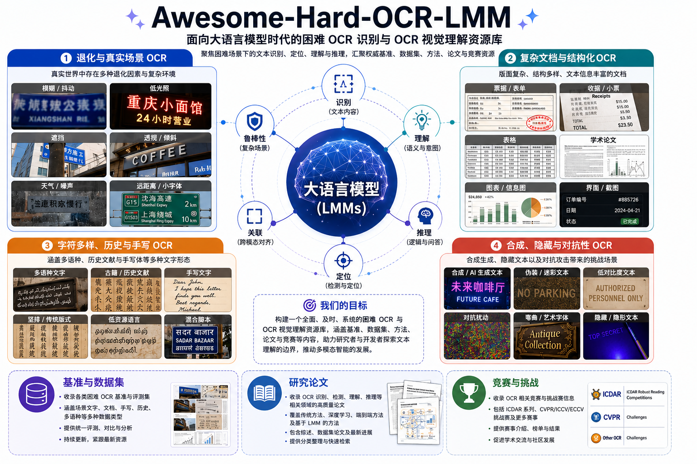

# Awesome-Hard-OCR-LMM

  <a href="./README.md">English</a> | <strong>简体中文</strong>

  
  
  
  

  

本仓库整理 **大多模态模型（LMMs）** 与 **视觉语言模型（VLMs）** 时代下，关于 **困难 OCR 识别** 与 **OCR 中心视觉理解** 的近期研究。

不同于通用 OCR、文档智能或宽泛的 MLLM benchmark 列表，本合集关注真正难以读懂图中文字的场景：退化和真实世界图像、密集或小文本、复杂文档结构、多语种和历史文字、手写、隐藏文本，以及合成/对抗视觉文本。本列表主要覆盖 **2023 年以来**的工作，因为这一时期 LMM/VLM 驱动的 OCR 与富文本视觉理解开始成为一个相对独立的研究方向。

🚀🚀🚀 欢迎贡献。如果你发现遗漏的论文、benchmark 或 challenge，请提交 issue，并附上标题、链接、venue/year，以及简短说明为什么它符合 hard OCR 的范围。

---

## 目录

- [介绍](#introduction)
- [Benchmarks 与数据集](#benchmarks-datasets)
- [研究论文](#research-papers)
  - [退化与真实世界 OCR](#degraded-and-in-the-wild-ocr)
  - [复杂文档与结构化 OCR](#complex-document-and-structured-ocr)
  - [脚本多样、历史与手写 OCR](#script-diverse-historical-and-handwritten-ocr)
  - [合成、隐藏与对抗 OCR](#synthetic-hidden-and-adversarial-hard-ocr)
- [竞赛](#competitions)
- [联系我们](#contact-us)

---

## ✨ 介绍

**Hard OCR** 指的是在具有视觉、语言、结构或合成难度条件下的 OCR 识别或 OCR 中心理解任务。本仓库的目标是追踪那些 OCR 不只是预处理步骤，而是多模态感知与推理核心瓶颈的研究工作。

### 🧭 分类体系

所有 **benchmarks 和数据集** 统一放在 **Benchmarks 与数据集** 中。**研究论文** 下的四个子章节只包含模型、方法或系统论文，不包含单独的 benchmark 条目。

| 类别 | 包含 | 不包含 |
|---|---|---|
| Benchmarks 与数据集 | OCR 中心 hard benchmark | 通用 MLLM benchmark |
| 退化与真实世界 OCR | 真实世界视觉难度：模糊、低分辨率、噪声、压缩、弱光、屏幕拍摄、扫描伪影、倾斜、遮挡、缺失文本、小文本或密集文本、复杂场景上下文 | 干净、清晰、容易图像上的普通场景文字识别 |
| 复杂文档与结构化 OCR | 结构性文档难度：版面与阅读顺序、表格、公式、图表、多页上下文、KIE、grounding 或关系抽取，以及忠实的 Markdown/HTML/LaTeX/JSON 风格输出 | 不显式处理结构挑战的普通 clean PDF-to-text OCR |
| 脚本多样、历史与手写 OCR | 脚本、书写风格或历史域偏移：低资源或非拉丁脚本、脚本特定正字法复杂性、历史或古代文档、书法、手写、手写公式、稀有脚本解读 | 高资源脚本中的普通现代印刷体 OCR |
| 合成、隐藏与对抗 Hard OCR | 合成、隐藏、错觉式、对抗或被篡改的视觉文本，其中识别、定位或鲁棒解释文本是核心 | 不显式评估 OCR/文本阅读的通用 VLM 攻击、jailbreak、宽泛 AIGC 风险检测或合成图像生成 |

---

### 🏷️ 交叉标签

一篇论文可能拥有多个标签，因为 hard OCR 的困难因素经常相互重叠。标签按其描述论文的作用进行分组。

| 分组 | 标签 | 含义 |
|---|---|---|
| 核心任务 | `recognition`, `localization` | 直接文本转录、字符/词识别、文本检测、grounding 或区域级 OCR。 |
| OCR 中心理解 | `reasoning`, `text-rich-vqa`, `document-qa`, `translation`, `KIE` | 依赖视觉文本的下游理解任务，包括基于 OCR 线索的推理、富文本图像或文档 VQA、跨语言 OCR/翻译，以及关键信息抽取。 |
| 视觉难度 | `degraded`, `occlusion`, `dense-text`, `high-resolution`, `scene-text`, `in-the-wild` | 困难视觉条件，如模糊、噪声、低分辨率、压缩、扫描伪影、遮挡或不完整文本、小/密集文本、高分辨率输入和真实世界场景文字。 |
| 文档结构 | `layout`, `structured-output`, `table/chart`, `table`, `formula`, `multi-page`, `long-context` | 页面结构和结构化转换，包括阅读顺序、多栏版面、Markdown/HTML/LaTeX/JSON 风格输出、表格、图表、公式、多页文档和长文本上下文。 |
| 语言与脚本 | `multilingual`, `low-resource`, `script-diverse`, `historical`, `handwriting` | 语言、脚本和书写风格偏移，包括多语种 OCR、低资源脚本、稀有脚本、历史文档、旧字体、书法和手写。 |
| 合成或对抗文本 | `synthetic-hard`, `hidden/adversarial` | 合成或 AIGC 创建的 hard OCR 样本、隐藏或错觉文本、对抗视觉文本，以及被篡改的视觉文本伪影。 |

[[⬆️ 返回顶部](#contents)]

---

## 📊 Benchmarks 与数据集

| Benchmark | 论文 | Venue & Year | 亮点 | 标签 | 下载 |
|---|---|---|---|---|---|
| OCRBench | [OCRBench: On the Hidden Mystery of OCR in Large Multimodal Models](https://arxiv.org/abs/2305.07895) | arXiv 2023 | 面向 LMM 的 OCR 评测，覆盖场景文本、文档 VQA、KIE 和手写数学。 | `recognition`, `document-qa`, `KIE`, `formula`, `handwriting` | [GitHub](https://github.com/Yuliang-Liu/MultimodalOCR/blob/main/OCRBench/README.md) |
| OCRBench v2 | [OCRBench v2: An Improved Benchmark for Evaluating Large Multimodal Models on Visual Text Localization and Reasoning](https://arxiv.org/abs/2501.00321) | NeurIPS D&B 2025 | 双语 benchmark，包含 31 个场景，评估识别、定位、版面感知和 OCR 推理。 | `recognition`, `localization`, `layout`, `reasoning` | [GitHub](https://github.com/Yuliang-Liu/MultimodalOCR/blob/main/OCRBench_v2/README.md) |
| CC-OCR | [CC-OCR: A Comprehensive and Challenging OCR Benchmark for Evaluating Large Multimodal Models in Literacy](https://arxiv.org/abs/2412.02210) | ICCV 2025 | 四个赛道覆盖多场景阅读、多语种阅读、文档解析和 KIE。 | `recognition`, `multilingual`, `layout`, `KIE` | [HuggingFace](https://huggingface.co/datasets/wulipc/CC-OCR) |
| CC-OCR V2 | [CC-OCR V2: Benchmarking Large Multimodal Models for Literacy in Real-world Document Processing](https://arxiv.org/abs/2605.03903) | arXiv 2026 | 面向企业真实文档处理的 OCR benchmark，覆盖解析、grounding 和 QA 中的 hard/corner cases。 | `recognition`, `layout`, `KIE`, `document-qa` | [HuggingFace](https://huggingface.co/datasets/Eioss/CC-OCR-V2) |
| OCR-Reasoning | [Reasoning-OCR: Can Large Multimodal Models Solve Complex Logical Reasoning Problems from OCR Cues?](https://arxiv.org/abs/2505.12766) | arXiv 2025 | 测试富文本图像上的逻辑推理能力，其中 OCR 线索必要但不充分。 | `reasoning`, `text-rich-vqa` | [HuggingFace](https://huggingface.co/datasets/mx262/OCR-Reasoning) |
| VCR-Wiki | [VCR: Visual Caption Restoration](https://arxiv.org/abs/2406.06462) | ICLR 2025 | 利用像素级提示和视觉上下文恢复部分遮挡的 caption。 | `recognition`, `occlusion`, `reasoning` | [GitHub](https://github.com/tianyu-z/VCR) |
| PsOCR | [PsOCR: Benchmarking Large Multimodal Models for Optical Character Recognition in Low-resource Pashto Language](https://arxiv.org/abs/2505.10055) | arXiv 2025 | 面向低资源普什图语、波斯-阿拉伯文字识别的合成 OCR 数据集与 benchmark。 | `recognition`, `multilingual`, `low-resource`, `script-diverse` | [HuggingFace](https://huggingface.co/datasets/zirak-ai/PashtoOCR) |
| KITAB-Bench | [KITAB-Bench: A Comprehensive Multi-Domain Benchmark for Arabic OCR and Document Understanding](https://arxiv.org/abs/2502.14949) | ACL Findings 2025 | 阿拉伯语 OCR/文档 benchmark，覆盖版面、行识别、表格、图表和 PDF-to-Markdown。 | `recognition`, `multilingual`, `layout`, `structured-output`, `table/chart` | [HuggingFace](https://huggingface.co/kitab-bench) |
| ThaiOCRBench | [ThaiOCRBench: A Task-Diverse Benchmark for Vision-Language Understanding in Thai](https://arxiv.org/abs/2511.04479) | IJCNLP-AACL 2025 | 泰语富文本 VLM benchmark，包含细粒度识别和手写内容抽取。 | `recognition`, `multilingual`, `handwriting`, `text-rich-vqa` | [HuggingFace](https://huggingface.co/datasets/typhoon-ai/ThaiOCRBench) |
| IndicVisionBench | [IndicVisionBench: Benchmarking Cultural and Multilingual Understanding in VLMs](https://arxiv.org/abs/2511.04727) | ICLR 2026 | 面向印度语言的 Indic 脚本 OCR、多模态翻译和 VQA。 | `recognition`, `multilingual`, `translation`, `document-qa` | [HuggingFace](https://huggingface.co/datasets/krutrim-ai-labs/IndicVisionBench) |
| KazakhOCR | [KazakhOCR: A Synthetic Benchmark for Evaluating Multimodal Models in Low-Resource Kazakh Script OCR](https://huggingface.co/papers/2603.13238) | ACL AbjadNLP 2026 | 合成哈萨克文字 OCR，覆盖字体、颜色、噪声、模糊和旋转变化。 | `recognition`, `multilingual`, `low-resource`, `synthetic-hard`, `degraded` | [HuggingFace](https://huggingface.co/datasets/henrygagnier/kazakh-ocr) |
| GlotOCR Bench | [GlotOCR Bench: OCR Models Still Struggle Beyond a Handful of Unicode Scripts](https://arxiv.org/abs/2604.12978) | arXiv 2026 | 跨 100+ Unicode 脚本的 OCR 泛化 benchmark，包含干净和退化渲染文本。 | `recognition`, `multilingual`, `script-diverse`, `degraded` | [HuggingFace](https://huggingface.co/datasets/cis-lmu/glotocr-bench) |
| Chronicles-OCR | [Chronicles-OCR: A Cross-Temporal Perception Benchmark for the Evolutionary Trajectory of Chinese Characters](https://arxiv.org/abs/2605.11960) | arXiv 2026 | 覆盖七类汉字形态演化的跨时间 benchmark，评估 spotting、古文字识别、解析和脚本分类。 | `recognition`, `historical`, `script-diverse`, `localization` | [GitHub](https://github.com/VirtualLUOUCAS/Chronicles-OCR) |
| OBI-Bench | [OBI-Bench: Can LMMs Aid in Study of Ancient Script on Oracle Bones?](https://arxiv.org/abs/2412.01175) | ICLR 2025 | 综合性甲骨文 benchmark，覆盖识别、缀合、分类、检索和释读。 | `recognition`, `historical`, `script-diverse`, `reasoning` | [GitHub](https://github.com/zijianchen98/OBI-Bench) |
| PictOBI-20k | [PictOBI-20k: Unveiling Large Multimodal Models in Visual Decipherment for Pictographic Oracle Bone Characters](https://arxiv.org/abs/2509.05773) | arXiv 2025 | 基于甲骨文字形与真实物体图像配对的象形甲骨文释读 benchmark。 | `recognition`, `historical`, `script-diverse`, `reasoning` | [GitHub](https://github.com/OBI-Future/PictOBI-20k) |
| AncientDoc | [Benchmarking Vision-Language Models on Chinese Ancient Documents: From OCR to Knowledge Reasoning](https://arxiv.org/abs/2509.09731) | arXiv 2025 | 中文古籍文档 benchmark，覆盖页面级 OCR、翻译、知识 QA 和推理 QA。 | `recognition`, `historical`, `script-diverse`, `reasoning`, `translation` | [HuggingFace](https://huggingface.co/datasets/ByteDance/AncientDoc) |
| BABMLLM | [BABMLLM: Benchmarking the Ancient Books Capability of MLLMs](https://www.nature.com/articles/s40494-025-01897-3) | npj Heritage Science 2025 | 评估 MLLM 对印刷和手写古籍的多模态处理能力。 | `recognition`, `historical`, `handwriting`, `reasoning` | N/A |
| HC-Bench | [SemVink: Advancing VLMs' Semantic Understanding of Optical Illusions via Visual Global Thinking](https://aclanthology.org/2025.emnlp-main.1381/) | EMNLP 2025 | 面向隐藏文本、隐藏物体和视觉错觉的 benchmark，测试 VLM 近乎失败的隐藏内容感知。 | `recognition`, `hidden/adversarial`, `synthetic-hard` | [HuggingFace](https://huggingface.co/datasets/JohnnyZeppelin/HC-Bench) |
| AdvOCR | [VACoT: Rethinking Visual Data Augmentation with VLMs](https://arxiv.org/abs/2512.02361) | arXiv 2025 | 对抗 OCR benchmark，配合推理时视觉增强方法。 | `recognition`, `hidden/adversarial`, `synthetic-hard` | [HuggingFace](https://huggingface.co/datasets/SincereX/AdvOCR) |
| SCAM | [SCAM: A Real-World Typographic Robustness Evaluation for Multimodal Foundation Models](https://arxiv.org/abs/2504.04893) | arXiv 2025 / DMLR 2026 | 真实世界 typographic attack 图像，覆盖物体类别和攻击词。 | `hidden/adversarial`, `scene-text`, `reasoning` | [HuggingFace](https://huggingface.co/datasets/BLISS-e-V/SCAM) |
| RIO-Bench | [Read or Ignore? A Unified Benchmark for Typographic-Attack Robustness and Text Recognition in Vision-Language Models](https://arxiv.org/abs/2512.11899) | arXiv 2025 | 同场景反事实样本，要求模型判断图中文字何时应被读取或忽略。 | `recognition`, `hidden/adversarial`, `reasoning` | [HuggingFace](https://huggingface.co/datasets/turing-motors/RIO-Bench) |

[[⬆️ 返回顶部](#contents)]

---

## 🚀 研究论文

### 🌍 退化与真实世界 OCR

*本节将 hard OCR 定义为真实世界视觉困难条件下的文本识别或 OCR 中心理解。收录论文应至少处理一种视觉瓶颈：模糊、低分辨率、噪声、压缩、弱光、屏幕拍摄、扫描伪影、倾斜、遮挡、缺失文本、小文本或密集文本、复杂场景上下文。干净、清晰、容易图像上的普通场景文字识别不在本节范围内。*

| 方法/系统 | 论文 | Venue & Year | 亮点 | 标签 | 代码 |
|---|---|---|---|---|---|
| CLIP4STR | [CLIP4STR: A Simple Baseline for Scene Text Recognition with Pre-trained Vision-Language Model](https://arxiv.org/abs/2305.14014) | arXiv 2023 / IEEE TIP 2024 | 将 CLIP 转化为场景文本识别器，结合视觉与跨模态分支以及 predict-and-refine 解码。 | `recognition`, `degraded`, `occlusion`, `scene-text` | [GitHub](https://github.com/VamosC/CLIP4STR) |
| Monkey | [Monkey: Image Resolution and Text Label Are Important Things for Large Multi-modal Models](https://arxiv.org/abs/2311.06607) | CVPR 2024 | 通过 patch 处理和多层次文本/物体描述支持更高分辨率的 LMM 输入。 | `dense-text`, `high-resolution`, `document-qa`, `scene-text` | [GitHub](https://github.com/Yuliang-Liu/Monkey) |
| Lumos | [Lumos: Empowering Multimodal LLMs with Scene Text Recognition](https://arxiv.org/abs/2402.08017) | KDD 2024 | 将场景文本识别集成到 MM-LLM 中，用于第一人称图像 QA。 | `recognition`, `scene-text`, `in-the-wild`, `text-rich-vqa` | N/A |
| Ocean-OCR | [Ocean-OCR: Towards General OCR Application via a Vision-Language Model](https://arxiv.org/abs/2501.15558) | arXiv 2025 | 采用 Native Resolution ViT 的 3B MLLM，面向文档、场景文本和手写识别。 | `recognition`, `degraded`, `scene-text`, `handwriting` | [GitHub](https://github.com/guoxy25/Ocean-OCR) |
| VLENet | [VLENet: A Duet of Perception and Reasoning for Scene Text Recognition](https://www.sciencedirect.com/science/article/pii/S092523122502908X) | Neurocomputing 2026 | 使用 CLIP 视觉表征和 LLM，为模糊场景文本生成可能候选并进行推理。 | `recognition`, `degraded`, `scene-text`, `reasoning` | N/A |

[[⬆️ 返回顶部](#contents)]

### 📄 复杂文档与结构化 OCR

*本节将 hard OCR 定义为文档解析或文档理解。收录论文应至少处理一种结构性瓶颈：版面与阅读顺序、表格、公式、图表、多页上下文、KIE、grounding 或关系抽取，或忠实的 Markdown/HTML/LaTeX/JSON 风格输出。不显式针对这些结构挑战的普通 clean PDF-to-text OCR 不在本节范围内。*

| 方法/系统 | 论文 | Venue & Year | 亮点 | 标签 | 代码 |
|---|---|---|---|---|---|
| KOSMOS-2.5 | [KOSMOS-2.5: A Multimodal Literate Model](https://arxiv.org/abs/2309.11419) | arXiv 2023 | 面向文本密集图像、空间文本块和结构化文本输出的 literate VLM。 | `recognition`, `dense-text`, `structured-output` | [GitHub](https://github.com/microsoft/unilm/tree/master/kosmos-2.5) |
| UReader | [UReader: Universal OCR-free Visually-situated Language Understanding with Multimodal Large Language Model](https://arxiv.org/abs/2310.05126) | EMNLP Findings 2023 | OCR-free MLLM，面向文档、表格、图表、自然图像和网页截图。 | `recognition`, `dense-text`, `document-qa`, `structured-output` | [GitHub](https://github.com/LukeForeverYoung/UReader) |
| TextMonkey | [TextMonkey: An OCR-Free Large Multimodal Model for Understanding Document](https://huggingface.co/papers/2403.04473) | arXiv 2024 / TPAMI 2026 | 面向高分辨率文档、截图、spotting 和 grounding 的文本中心 LMM。 | `recognition`, `localization`, `dense-text` | [GitHub](https://github.com/Yuliang-Liu/Monkey) |
| GOT-OCR2.0 | [GOT-OCR2.0: General OCR Theory](https://arxiv.org/abs/2409.01704) | arXiv 2024 | 统一端到端 OCR-2.0 模型，处理文本、公式、表格、图表、乐谱和几何图形。 | `recognition`, `structured-output`, `formula`, `table/chart` | [GitHub](https://github.com/Ucas-HaoranWei/GOT-OCR2.0) |
| mPLUG-DocOwl2 | [mPLUG-DocOwl2: High-resolution Compressing for OCR-free Multi-page Document Understanding](https://aclanthology.org/2025.acl-long.291/) | ACL 2025 | 基于高分辨率压缩的 OCR-free 多页文档理解。 | `layout`, `multi-page`, `document-qa` | [GitHub](https://github.com/X-PLUG/mPLUG-DocOwl) |
| MonkeyOCR | [MonkeyOCR: Document Parsing with a Structure-Recognition-Relation Triplet Paradigm](https://arxiv.org/abs/2506.05218) | arXiv 2025 | 基于结构-识别-关系三元范式的文档解析器。 | `recognition`, `layout`, `structured-output` | [GitHub](https://github.com/Yuliang-Liu/MonkeyOCR) |
| PaddleOCR-VL | [PaddleOCR-VL: Boosting Multilingual Document Parsing via a 0.9B Ultra-Compact Vision-Language Model](https://arxiv.org/abs/2510.14528) | arXiv 2025 | 面向多语种文档解析和元素识别的紧凑型 VLM。 | `recognition`, `multilingual`, `table/chart`, `formula` | [GitHub](https://github.com/PaddlePaddle/PaddleOCR) |
| DeepSeek-OCR | [DeepSeek-OCR: Contexts Optical Compression](https://arxiv.org/abs/2510.18234) | arXiv 2025 | 面向长文本上下文的光学二维映射与视觉压缩。 | `recognition`, `dense-text`, `long-context` | [GitHub](https://github.com/deepseek-ai/DeepSeek-OCR) |
| olmOCR 2 | [olmOCR 2: Unit Test Rewards for Document OCR](https://huggingface.co/papers/2510.19817) | arXiv 2025 | 通过可验证单元测试奖励进行结构化文档 OCR 强化学习。 | `structured-output`, `formula`, `table`, `layout` | [GitHub](https://github.com/allenai/olmocr) |
| MonkeyOCR v1.5 | [MonkeyOCR v1.5: Unlocking Robust Document Parsing for Complex Patterns](https://arxiv.org/abs/2511.10390) | arXiv 2025 | 面向复杂模式的两阶段 VLM 文档解析框架。 | `recognition`, `layout`, `structured-output` | [GitHub](https://github.com/Yuliang-Liu/MonkeyOCR) |
| dots.ocr | [dots.ocr: Multilingual Document Layout Parsing in a Single Vision-Language Model](https://arxiv.org/abs/2512.02498) | arXiv 2025 | 单一 VLM 同时进行多语种版面检测、文本识别和关系理解。 | `recognition`, `layout`, `multilingual` | [GitHub](https://github.com/rednote-hilab/dots.ocr) |
| PaddleOCR-VL-1.5 | [PaddleOCR-VL-1.5: Towards a Multi-Task 0.9B VLM for Robust In-the-Wild Document Parsing](https://arxiv.org/abs/2601.21957) | arXiv 2026 | 面向真实世界鲁棒文档解析的多任务紧凑型 VLM。 | `recognition`, `layout`, `table/chart`, `formula` | [GitHub](https://github.com/PaddlePaddle/PaddleOCR) |
| GLM-OCR | [GLM-OCR Technical Report](https://arxiv.org/abs/2603.10910) | arXiv 2026 | 采用两阶段 layout-to-recognition pipeline 的紧凑多模态 OCR 模型。 | `recognition`, `layout`, `formula`, `KIE` | [GitHub](https://github.com/zai-org/GLM-OCR) |
| Qianfan-OCR | [Qianfan-OCR: A Unified End-to-End Model for Document Intelligence](https://arxiv.org/abs/2603.13398) | arXiv 2026 | 4B VLM，使用 Layout-as-Thought 在最终输出前进行显式版面推理。 | `layout`, `structured-output`, `reasoning`, `KIE` | [GitHub](https://github.com/baidubce/Qianfan-VL) |

[[⬆️ 返回顶部](#contents)]

### ✍️ 脚本多样、历史与手写 OCR

*本节将 hard OCR 定义为脚本、书写风格或历史域偏移下的识别或 OCR 中心理解。收录论文应至少处理以下挑战之一：低资源或非拉丁脚本、脚本特定正字法复杂性、历史或古代文档、书法、手写、手写公式，或稀有脚本的视觉释读。高资源脚本中的普通现代印刷体 OCR 不在本节范围内，除非论文明确针对上述挑战之一。*

| 方法/系统 | 论文 | Venue & Year | 亮点 | 标签 | 代码 |
|---|---|---|---|---|---|
| CHURRO | [CHURRO: Making History Readable with an Open-Weight Large Vision-Language Model for High-Accuracy, Low-Cost Historical Text Recognition](https://arxiv.org/abs/2509.19768) | EMNLP 2025 | 高精度、低成本的开源权重历史文本识别 VLM。 | `recognition`, `historical`, `handwriting`, `multilingual` | [GitHub](https://github.com/stanford-oval/Churro) |
| Historical mLLM OCR | [Multimodal LLMs for OCR, OCR Post-Correction, and Named Entity Recognition in Historical Documents](https://arxiv.org/abs/2504.00414) | arXiv 2025 | 研究 mLLM 在历史文档转录、OCR 后纠错和命名实体识别中的作用。 | `recognition`, `historical`, `degraded` | N/A |
| Nayana OCR | [Nayana OCR: A Scalable Framework for Document OCR in Low-Resource Languages](https://openreview.net/forum?id=uaQR3BgHrV) | ICCVW 2025 | 针对十种 Indic 语言，结合 layout-aware 合成数据和 LoRA 进行 VLM 适配。 | `recognition`, `multilingual`, `low-resource` | N/A |
| QARI-OCR | [QARI-OCR: High-Fidelity Arabic Text Recognition with Multimodal Large Language Model Adaptation](https://arxiv.org/abs/2506.02295) | arXiv 2025 | 基于 Qwen2-VL 的阿拉伯语 OCR 模型，覆盖印刷体、带音标文本、低分辨率和手写阿拉伯语。 | `recognition`, `multilingual`, `low-resource`, `handwriting` | N/A |
| Baseer | [Baseer: An Arabic Vision-Language Model for Document-to-Markdown OCR](https://arxiv.org/abs/2509.18174) | arXiv 2025 | 阿拉伯语 document-to-Markdown OCR VLM，使用合成和真实阿拉伯文档微调。 | `recognition`, `multilingual`, `structured-output`, `layout` | N/A |
| CalliReader | [CalliReader: Contextualizing Chinese Calligraphy via Embedding-Aligned Vision-Language Model](https://arxiv.org/abs/2503.06472) | ICCV 2025 | 基于 embedding alignment 的 VLM，用于整页中文书法识别与解释。 | `recognition`, `historical`, `script-diverse`, `reasoning` | [GitHub](https://github.com/LoYuXr/CalliReader) |
| CalligraphicOCR | [CalligraphicOCR: Towards End-to-End Chinese Calligraphy Recognition with Large Multimodal Model](https://aclanthology.org/2025.emnlp-main.245/) | EMNLP 2025 | 结合图像增强和 action-based corrector 的中文书法识别方法。 | `recognition`, `historical`, `script-diverse` | [GitHub](https://github.com/HoraceXIaoyiBao/COCR-EMNLP2025) |
| Uni-MuMER | [Uni-MuMER: Unified Multi-Task Fine-Tuning of Vision-Language Model for Handwritten Mathematical Expression Recognition](https://huggingface.co/papers/2505.23566) | arXiv 2025 | 面向手写数学表达式识别的统一多任务 VLM 微调。 | `handwriting`, `formula`, `structured-output` | [GitHub](https://github.com/bflameswift/uni-mumer) |
| V-Oracle | [V-Oracle: A Progressive Reasoning Framework for Oracle Bone Script Deciphering](https://aclanthology.org/2025.acl-long.986/) | ACL 2025 | 结合视觉和语言证据的甲骨文释读渐进式推理框架。 | `recognition`, `historical`, `script-diverse`, `reasoning` | N/A |
| OracleAgent | [OracleAgent: A Multimodal Reasoning Agent for Oracle Bone Script Research](https://www.researchgate.net/publication/397087875_OracleAgent_A_Multimodal_Reasoning_Agent_for_Oracle_Bone_Script_Research) | arXiv 2026 | 面向甲骨文研究的多模态 agent，编排工具和知识库完成检索与推理。 | `historical`, `script-diverse`, `reasoning` | [GitHub](https://github.com/lcs0215/OralceAgent) |

[[⬆️ 返回顶部](#contents)]

### 🧪 合成、隐藏与对抗 Hard OCR

*本节将 hard OCR 定义为对合成、隐藏、错觉式、对抗或被篡改视觉文本的识别、定位或鲁棒解释。收录论文应将 OCR 或视觉文本阅读作为核心任务。不显式评估 OCR/文本阅读的通用 VLM 攻击、jailbreak、宽泛 AIGC 风险检测或合成图像生成不在本节范围内。*

| 方法/系统 | 论文 | Venue & Year | 亮点 | 标签 | 代码 |
|---|---|---|---|---|---|
| SemVink | [SemVink: Advancing VLMs' Semantic Understanding of Optical Illusions via Visual Global Thinking](https://aclanthology.org/2025.emnlp-main.1381/) | EMNLP 2025 | 使用视觉全局思考策略，如低分辨率缩放，提升隐藏/错觉内容感知。 | `hidden/adversarial`, `recognition` | [GitHub](https://github.com/johnnyZeppelin/vlm-semvink) |
| VACoT | [VACoT: Rethinking Visual Data Augmentation with VLMs](https://arxiv.org/abs/2512.02361) | arXiv 2025 | 推理时 VLM 视觉增强方法，包含 crop、denoise、enhance 和工具选择，用于困难感知和对抗 OCR。 | `hidden/adversarial`, `synthetic-hard`, `recognition` | N/A |
| AIGuard | [AIGuard: A Benchmark and Lightweight Detection for E-commerce AIGC Risks](https://aclanthology.org/2025.findings-acl.643/) | ACL Findings 2025 | 检测电商图像中的 AIGC 风险内容，包括隐藏或问题视觉文本相关场景。 | `synthetic-hard`, `hidden/adversarial`, `in-the-wild` | [GitHub](https://github.com/wenh-zhang/aiguard-dataset) |

[[⬆️ 返回顶部](#contents)]

---

## 🏆 竞赛

| 竞赛 | Venue / Platform & Year | 亮点 | 链接 |
|---|---|---|---|
| DataMFM Challenge: Document Parsing + Chart Understanding | CVPR Workshop 2026 | 针对自然文本、表格、公式、版面和图表的结构化文档解析与图表理解 | [Challenge Website](https://datamfm.github.io/challenge.html) |
| Handwritten to Data: Ukrainian OCR | Kaggle 2026 | 乌克兰语手写文本识别，适合追踪低资源手写 OCR | [Kaggle / News](https://nahornyi.ai/ru/news/kaggle-handwritten-to-data-ukr-ocr) |
| HTR: Handwritten Text Recognition and Understanding | ICDAR 2025 | 历史手写文本识别，并包含文档级理解赛道 | [Competition Website](https://prhlt-carabela.prhlt.upv.es/ICDAR25HTRU/) |
| Handwritten Notes Understanding | ICDAR 2025 | 手写笔记理解与 OCR 中心文档解释 | [RRC Page](https://rrc.cvc.uab.es/?ch=33) |
| Indic Handwritten Document Recognition | ICDAR 2025 | 跨多种脚本和版面的 Indic 页面级手写识别 | [Competition Website](https://ilocr.iiit.ac.in/icdar_2025_Indic_HDR/) |
| FEST: Few-shot Text-line Segmentation of Ancient Handwritten Documents | ICDAR 2025 | 面向古代手写文档的低标注文本行分割 | [Competition Website](https://ai4ch.uniud.it/FESTcompICDAR25/) |
| Historical Map Text Detection, Recognition, and Linking | ICDAR 2025 | 旋转、弯曲、低质量历史地图文本，以及词到短语链接 | [RRC Page](https://rrc.cvc.uab.es/?ch=32) |
| Document Image Machine Translation Challenge | ICDAR 2025 | 复杂版面下的 OCR-free/OCR-based 文档图像翻译 | [Competition Website](https://cip-documentai.github.io/) |
| Multi-lingual Roadside Scene Text Recognition | ICDAR 2025 | 路侧场景文本、多语种 OCR 与脚本识别 | [Competition Website](https://ilocr.iiit.ac.in/icdar_2025_MLT-RSTR/) |
| Glyph Detection in 15th-Century European Printed Documents | ICDAR 2025 | 15 世纪欧洲早期印刷文档中的历史字形检测与识别 | [Competition Website](https://lme.tf.fau.de/competitions/icdar-2025-competition-on-glyph-detection-in-15th-century-european-printed-documents/) |
| Recognition and VQA on Handwritten Documents | ICDAR 2024 | 孤立词识别、页面级阅读和手写文档 VQA | [Competition Website](https://ilocr.iiit.ac.in/icdar_2024_hwd/) |
| Reading Documents Through Aria Glasses | ICDAR 2024 | 低分辨率可穿戴相机文档 OCR、阅读顺序和页面阅读 | [Competition Website](https://ilocr.iiit.ac.in/icdar_2024_rdtag/) |
| Historical Map Text Detection, Recognition, and Linking | ICDAR 2024 | 历史地图 OCR 与文本链接 | [RRC Page](https://rrc.cvc.uab.es/?ch=28) |
| Historical Ciphers | ICDAR 2024 | 具有特殊符号的历史手写密码识别 | [RRC Page](https://rrc.cvc.uab.es/?ch=27) |
| CROCS: Recognition of Chemical Structures | ICDAR 2024 | 手写/符号化学结构识别 | [Competition Website](https://crocs-ifly-ustc.github.io/crocs/index.html) |
| Indic Handwriting Text Recognition | ICDAR 2023 | 十种 Indic 语言，覆盖连写字符、手写变化和非结构化书写 | [Competition Website](https://ilocr.iiit.ac.in/ihtr/) |
| VQA on Business Document Images | ICDAR 2023 | 商业文档 OCR、表格、表单和版面密集文档 VQA | [Competition Website](https://ilocr.iiit.ac.in/vqabd/) |
| DUDE: Document Understanding in the Wild | ICDAR 2023 | 多页视觉丰富文档理解和基于 OCR 的 QA | [RRC Page](https://rrc.cvc.uab.es/?ch=23) |
| HierText: Hierarchical Text Detection and Recognition | ICDAR 2023 | 自然图像中的层级文本检测、识别和版面分析 | [Google Research](https://research.google/pubs/icdar-2023-competition-on-hierarchical-text-detection-and-recognition/) |
| CROHME: Handwritten Mathematical Expression Recognition | ICDAR 2023 | 在线/离线/双模态手写数学表达式识别 | [Zenodo](https://zenodo.org/records/8428035) |
| Robust Reading Competition Portal | RRC / CVC Ongoing | 汇集场景文本、文档、视频文本和阅读竞赛的挑战门户，包含多个 ICDAR 相关任务 | [RRC Portal](https://rrc.cvc.uab.es/) |

[[⬆️ 返回顶部](#contents)]

## 📮 联系我们

如果你有问题、建议，或希望讨论潜在合作，欢迎联系：

- Linhan Cao: `caolinhan@sjtu.edu.cn`
- Siyuan Li: `kongfu.lsy@antgroup.com`
- Jun Lan: `yelan.lj@antgroup.com`
